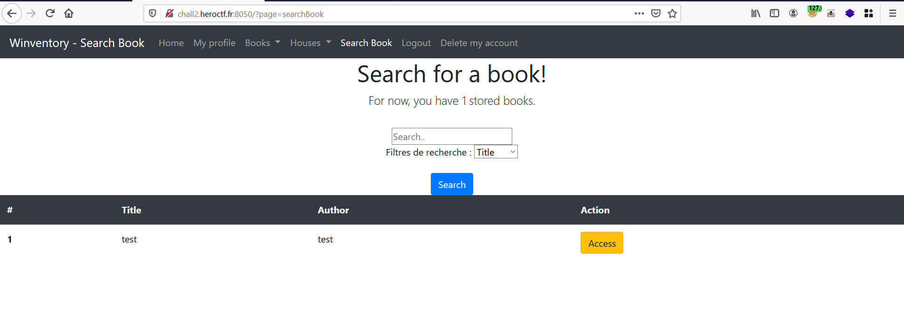

<h1>Challange : Winventory</h1>

<h1>Description</h1>

As a Pentester, you offer your services to this company to test the security of the website.

After some research, you find that security for this company is not the main area.

It's up to you!

URL : ```http://chall2.heroctf.fr:8050```

<h1>Solution</h1>
Let's access the given URL, we can see there is login page with a registration functionality.


After successful registration. let's login to the Winventory portal

 

Here the functionality is we can add books to houses and we can access our own books in the search books menu.

So lets quickly add our books into houses and try to access them.


Our newly created books will get reflected in the search books menu.



let's try to access our book, the following GET request will be sent to the server to retrieve the book.

```
GET /?page=manageBook&id=439 HTTP/1.1
Host: chall2.heroctf.fr:8050
User-Agent: Mozilla/5.0 (Windows NT 10.0; Win64; x64; rv:88.0) Gecko/20100101 Firefox/88.0
Accept: text/html,application/xhtml+xml,application/xml;q=0.9,image/webp,*/*;q=0.8
Accept-Language: en-US,en;q=0.5
Accept-Encoding: gzip, deflate
Connection: close
Referer: http://chall2.heroctf.fr:8050/?page=searchBook
Cookie: PHPSESSID=b970154eb1a0264b84126bf527934f4b
Upgrade-Insecure-Requests: 1
```

Lets try to Bruteforce the id value and check if we are able to access any admin books. 


So We can only access our own books.

Upon attempting for SQL injection using the following payload ```'';select+sleep(5)--``` we got Succeeded.


we can dump the DB to find out the creds.

using the following payloads we can dump the database email & password 

1.```+AND+updatexml(rand(),concat(0x3a,(select+email+from+users+limit+0,1)),null)``` 

2.```+AND+updatexml(rand(),concat(0x3a,(select+password+from+users+limit+0,1)),null)``` 

Dumping email


Dumping password


After checking the hash length it just shows 31 length. we can try Bruteforcing the missing 32nd character and the final hash is ```6431468f98f6552c3af0816307f91c01``` . 

After decrypting the md5 hash, we  got the following password  ```urfaceismassive```


Using the above password we can login to Admin account and there is an image upload feature.


since the application is developed on PHP. We can try uploading a PHP file directly but the application is rejecting the file because there is file extension validation.


we can try uploading a PHP file with double extension to bypass the extension validation.


After accessing the uploaded file we have successfully got RCE on the server.


And we can access the flag in the root Directory.

